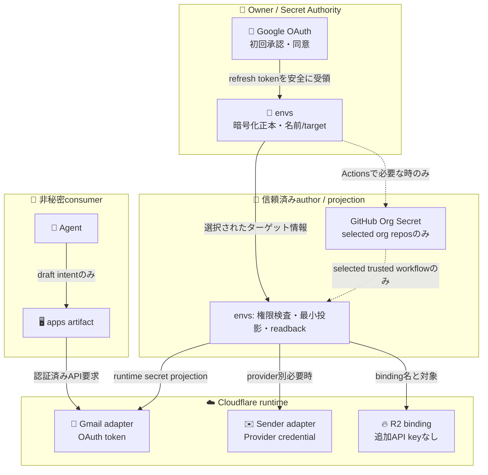

# 🔐 Mail Cell — envs / Org Secret / runtime binding（設計案）

Ref: [ADRS #578](https://github.com/roccho-dev/adrs/issues/578) / [apps PR #80](https://github.com/roccho-dev/apps/pull/80) / [ADRS #443](https://github.com/roccho-dev/adrs/issues/443) / [ADRS #547](https://github.com/roccho-dev/adrs/issues/547)

状態: **PROPOSAL / non-binding documentation only**。secret値、SOPS ciphertext、GitHub Org Secret、Cloudflare runtime secret、OAuthアプリ、DNSは**作成/変更しない**。実際の値・target・権限は別途承認し、元となる`contracts/environments.jsonl` / `contracts/bindings.jsonl`へ採用・投影する。

## 🎯 契約上の位置づけ

- `roccho-org/envs`：credential意味・ライフサイクル・選択先・暗号化正本・handoffを管理。
- `roccho-org` **GitHub Actions Org Secret**：信頼済みorg所有workflowへ、必要な時だけ物理投影する**target slot**。ここ自体を二重の秘密正本としない。
- Cloudflare Worker/Pages secret：**実行時target slot**。Org Secretを自動的に読めるわけではない。明示的なenvs投影が必要。
- `roccho-dev/apps`：個人所有repoなので**roccho-orgのOrg Secretを直接読めない**。アプリのproduct source / public artifactにはcredentialsを含めない。
- R2：Worker R2 bindingを使うならruntimeのS3 Access Keyは要らない。別のR2 API tokenを新造しない。
- Gmailの下書き：OAuthの`gmail.compose`等は送信可能な強い権限を含む。**draft-only OAuth scopeの存在を仮定しない**。credentialはAgentから隔離し、選択したAPI操作だけをWorkerが実行できるようにする。

## 🔑 必要入力・候補の最小表

| 入力名（提案） | 種別 | 置き場所と利用者 | 時点 / 条件 |
|---|---|---|---|
| `MAIL_GMAIL_OAUTH_CLIENT_ID` | 非秘密variable | envs binding → 対象Google OAuth client | Gmail API利用時 |
| `MAIL_GMAIL_OAUTH_CLIENT_SECRET` | secret | envs source → 必要なauthor/projection → Cloudflare runtime secret | confidential OAuth clientを採用した時 |
| `MAIL_GMAIL_OAUTH_REFRESH_TOKEN` | secret | envs source → Cloudflare runtime secret（Gmail adapterのみ） | 初回OAuth同意後、draft/読み書き利用時 |
| `MAIL_SEND_PROVIDER_API_KEY` | secret / **条件付き** | envs source → 選択した送信Provider runtime | 別のSMTP/API providerにkeyが必要な時だけ |
| `CLOUDFLARE_API_TOKEN` | 既存のsecret名 | 既存envs author/projection plane | Cloudflare設定/API作用が必要な時。利用scopeを検証し安易に複製しない |
| `CLOUDFLARE_ACCOUNT_ID` / `CLOUDFLARE_ZONE_ID` | 非秘密variable | envs binding → provisioning | 対象アカウント/zoneを選択 |
| `MAIL_DOMAIN` / `MAIL_R2_BUCKET` | 非秘密variable | envs binding → Worker config | domain/bucketの選択 |
| `MAIL_FORWARD_TO` | 宛先config（要アクセス制御） | envs binding → Email Routing | Gmail宛を認証済み転送先として登録した後 |
| `MAIL_APPROVER_ID` / `MAIL_ACCESS_AUD` | 非秘密ID | envs binding → 承認ゲート | Access等の認証済みsubjectとaudienceを検証 |

**不要な物理secret**：`R2_ACCESS_KEY_ID`, `R2_SECRET_ACCESS_KEY`（Worker-native R2 bindingの場合）、`MAIL_MANUAL_SEND_PASSWORD`（既存認証/認可を利用する場合）。Google Workspace契約も必須ではない。

## 🏢 Org Secret と Worker の区別

| Target | 可否 | 期待状態 |
|---|---|---|
| `roccho-org/envs`のActions | Org Secret利用可能（selected repositoriesが必要） | author/projection時だけ |
| `roccho-org/ops`のActions | Org Secret利用可能（selected repositoriesが必要） | 本当にworkflowで必要な時だけ |
| `roccho-dev/apps`のActions | **roccho-org Org Secretは利用不可** | secret-free build／artifact |
| Cloudflare Worker runtime | Org Secretを直接利用不可 | envsから必要なruntime secretへ投影 |
| Agent / browser client | refresh token / provider keyを配布しない | capability経由のみ |

`Org Secret` は常時必須ではない。信頼済みActionsが本当に秘密を使う場合のみ作成し、**単にappsへ実行時credentialを置くために全repoへ配布しない**。既存 [envs#52](https://github.com/roccho-org/envs/issues/52) のJeV固有経路をmail一般化の口実にしない。

## 🌳 envs側の予定tree（今は追加しない）

```text
roccho-org/envs/
├─ contracts/
│  ├─ bindings.jsonl       # mail capability・selected target・providerを追加する候補
│  ├─ environments.jsonl   # stage別required input name/type/lifecycle候補
│  ├─ provider-consumer.jsonl  # apps/sourceとenvs/effectの禁止依存
│  └─ targets.jsonl        # Workerのbinding / selected runtime target
├─ ciphertexts/            # 初回承認後に作るSOPS暗号文だけ
├─ adapters/               # 既存author/projection/readbackを再利用（別実装は原則不要）
├─ handoffs/               # providerへ本当に投影・読戻し成功した場合だけ
└─ checks/                 # 入力/target検査・秘密値を含まない負のテスト
```

## 🔄 Secret投影のデータフロー



## 🚫 絶対に通してはいけない10件

1. `roccho-dev/apps`に`roccho-org` Org Secretを配ったつもりになる。
2. OAuth refresh tokenをpublic repo、PR、CIログ、`envs`平文へ書く。
3. `MAIL_GMAIL_OAUTH_CLIENT_SECRET`が不要なOAuth clientなのに強制する。
4. AgentがOAuth credentialやSend provider tokenを直接取得する。
5. `gmail.compose`を下書きだけ送信可能と誤解する。
6. Cloudflare Worker runtimeがGitHub Org Secretを直接読めると誤解する。
7. providerのスコープ・target未確認で同一Org Secretを全repoへ公開する。
8. 必要なR2 bindingがあるのにS3型R2 keyを重複投入する。
9. 前回投影のreadbackなしにsuccess・secret readyを名乗る。
10. Secretの名前が一致しただけで実Gmail/Cloudflare利用をPASS扱いする。
11. Gmail転送先の未認証時に稼働完了と主張する。
12. 認証済み本人以外の承認APIアクセスを許す。
13. secretのローテーションで以前の権限を広げる。
14. Cloudflare Email Sendingの適用条件未確認で送信Providerを固定する。

## ✅ 実装・採択の順序

1. ADRS #578 と apps PR #80 の意味境界（特に人間承認と送信）をレビュー。
2. 公開の`contracts/`に **名前 / 種類 / lifecycle / selected target** を追加（別途承認）。
3. Google OAuth clientと転送先認証、Providerの用途・認可をOwnerが準備（別途承認）。
4. 必要な時だけSOPS暗号化正本→target native secretへ投影、name-only readback。
5. アプリのdraft→固定版→承認→送信→receiptを実環境で検証。

このPRでは **手順1の設計記録のみ**。配布・秘密値設定・外部送信・merge/production cutover・Google OAuth client作成のGOなし。
