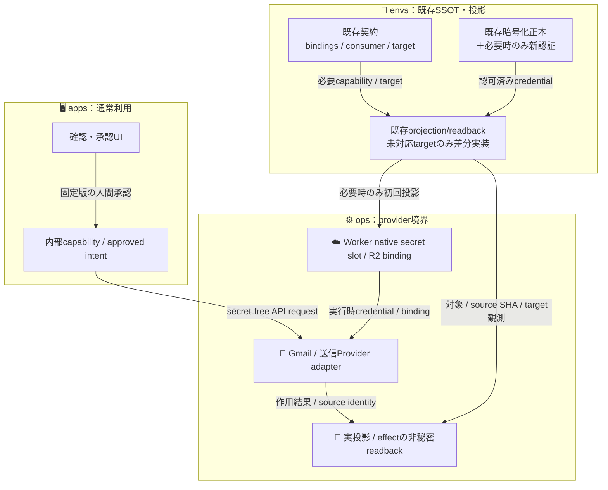

# 🔐 Mail Cell — envs既存投影の再利用（設定追加は差分だけ）

Ref: [ADRS #578](https://github.com/roccho-dev/adrs/issues/578) / [ADRS #443](https://github.com/roccho-dev/adrs/issues/443) / [ADRS #386](https://github.com/roccho-dev/adrs/issues/386) / [ADRS #547](https://github.com/roccho-dev/adrs/issues/547) / [apps PR #80](https://github.com/roccho-dev/apps/pull/80) / [ops PR #509](https://github.com/roccho-org/ops/pull/509)

**状態: PROPOSAL / docs-only**。秘密値、Org Secret、Cloudflare runtime、Google OAuth、契約本体、IaC、製品実装・送信は変更しない。

## 🎯 結論：製品ごとのSecret設定を復活させない

既存の `envs` は認証・Bindingの**唯一の管理元**であり、`ops/apps` が同じ秘密・target・required inputを毎回書き直す必要はない。consumerの通常実行はenvs checkout / workflow / SOPS / age を要求しない。目的は「**新しい認証情報の初回取得までゼロ**」ではなく「**既にある設定の二重宣言・配布・毎回の手動介入をゼロ**」にすること。

| 既存実体 | 状態と保証の範囲 |
|---|---|
| [ADRS #443](https://github.com/roccho-dev/adrs/issues/443) | consumer → 内部capability、envs → target native slot → provider boundary。provider credentialをconsumerへ配らない |
| [envs PR #48](https://github.com/roccho-org/envs/pull/48) | **MERGED**：既存`contracts/bindings.jsonl`・`provider-consumer.jsonl`からpublic provision factsを自動投影。**新しいprovider secretを自動で実配置する機能ではない** |
| [ops PR #494](https://github.com/roccho-org/ops/pull/494) | **MERGED**：requirementとprovision/evidenceの差分検出。実provider READYの保証ではない |
| [envs PR #54](https://github.com/roccho-org/envs/pull/54) | **MERGED**：JEV_API_KEYのSOPS→roccho-org Org Secretへの**1件の実投影・native readback**。Ops repo/Environmentへの複製ゼロ。Jev consumer real useは別証拠で`NOT_RUN` |
| [envs PR #57](https://github.com/roccho-org/envs/pull/57) | **OPEN**：Go source authoring向け差分。CI成功だが未merge/未実secret effect |

以上の既存機能を呼ぶ。mail専用の第2のenvs provider、共通configフレームワーク、新しいSecret台帳を作らない。

## 🌳 変更対象の正しいtree

```text
roccho-org/envs/
├─ contracts/
│  ├─ bindings.jsonl           # 新capability/targetが本当に不足した場合の差分行
│  ├─ environments.jsonl       # 初回入力が本当に必要な場合の差分行
│  └─ provider-consumer.jsonl  # 所有/禁止依存が実際に不足する場合の差分行
├─ adapters/                  # 既存 author / projection / readback を優先再利用
├─ ciphertexts/               # 未保有credentialを許可後に暗号化した場合のみ
└─ handoffs/                  # 実体へのeffect＋readbackを経た非秘密証拠のみ
```

**追加するdocs・schema・汎用runnerは0候補から開始**。このPRのdocsは討議を置くための例外であり、新しい設定SSOTではない。既存sourceで表現できるなら追加も不要。mail用の秘密名を10個固定する、`MAIL_*`行を先に全件作る、といった設計は採用しない。

## 📬 Mail Cellで必要になり得る「新規分」だけ

| 対象 | 既存の再利用先 | 初回追加が必要となる条件 |
|---|---|---|
| 🔥 Worker → R2 | Cloudflare Workerの**R2 binding**、opsの既存配置/設定 | bucket・bindingがまだ存在しない時。**R2 Access Keyは通常不要** |
| 📨 Email Routing / 独自ドメイン | ops側の既存Cloudflare設定/IaC・envsの既存認証 | MX/route/転送先が未作成・未認証の時。転送先Gmail認証は初回の人間確認 |
| ❄️ Gmail Draft/Cold | provider boundaryのGmail API＋envs secret authority | Gmailを直接Workerから操作する場合、Google OAuthアプリ・権限・本人同意・継続tokenの新規取得が必要。**ChatGPT接続Gmailの認証をWorkerへ流用できる前提にしない** |
| 🚀 独自ドメイン送信 | opsの交換可能な送信provider boundary | 対象providerが新しいcredentialを要求する時だけenvsで1つの新capability/source/targetを登録。Cloudflare Email Sendingの通常メールへの適合は先に確認 |
| ✅ 送信承認 | appsの本人認証＋承認ゲート | 既存Identityを使う。権限・信頼できるactorの不足が確認されるまで独自の承認パスワードを作らない |

Google OAuthの`gmail.compose`等は送信可能な権限を含みうる。Agentとbrowserに渡すのは内部capabilityのみ。Secret投影の新しいtarget adapterが必要かは、現在の実sourceで検査して不足した対象**だけ**対応する。envs PR #48のpublic projectionや #54の**Jev専用** Org Secret bootstrapが、新しいGmail Worker OAuthの物理投影まで実装済みであるとは**主張しない**。

## 🏗️ 二つのフロー（データエッジ付き）



**禁止エッジ**：apps/Agent/browser → provider credential、consumer通常実行 → envs CI/SOPS、org secret → 異なるorgのrepo、`secret-name`存在のみ → provider PASS。

## ⚠️ 破綻ケース・採用ゲート

1. 既存のCloudflare認証を使えるのにmail専用tokenを追加する → 却下。
2. Providerに新しいcredentialが必要なのに「設定0」と扱う → 却下。
3. `roccho-org` Org Secretを`roccho-dev/apps`が直接読む想定 → 却下。
4. Org SecretをCloudflare runtime secretと同一視 → 却下。
5. OAuthの初回本人同意をCIが自動代行できるとみなす → 却下。
6. GmailのChatGPT接続認証をWorkerへ流用する → 却下。
7. AgentへGmail送信可能tokenを渡す → 却下。
8. R2 Worker bindingがあるのにS3 access keyを追加 → 却下。
9. Cloudflare Sending一般返信用途の適合を未検証で固定 → 却下。
10. source-only CI合格やSecret slot presenceをProvider利用成功へ昇格 → 却下。
11. secretをopsのRepo/Environmentへ複製してOrg側と二重正本化 → 却下。
12. consumerを1つ追加するたびsecret source/targetを複製 → 却下。

## ✅ 次の正しい実装手順

1. Mailが利用する**既存 capability / environment / binding / provider adapter**をreadbackし、再利用できるものを差し引く。
2. 未保有の**credentialの初回発行・Google同意**と、未作成の**実行先**だけを列挙。存在しない新規分以外は変更しない。
3. 現在のenvs source shapeで不足する対象だけ、既存契約へ最小行を追加し、既存projection/readback入口で実行可能か検証する。
4. 要求（ops）↔提供（envs）↔receiptを既存差分機構で照合。新しい比較器を作らない。
5. 真のprovider effect・独立consumer実行・承認した送信内容をreadbackして初めてREADY。

**このPRは経路の訂正のみ。** Secret作成・credential配布・実送信・merge・本番構成の変更は行わない。
